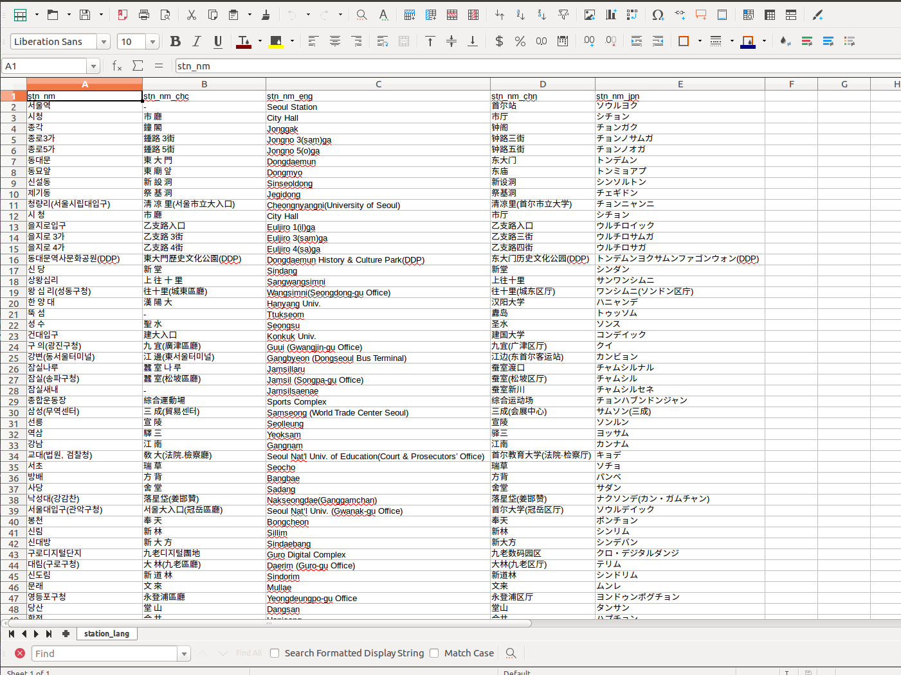
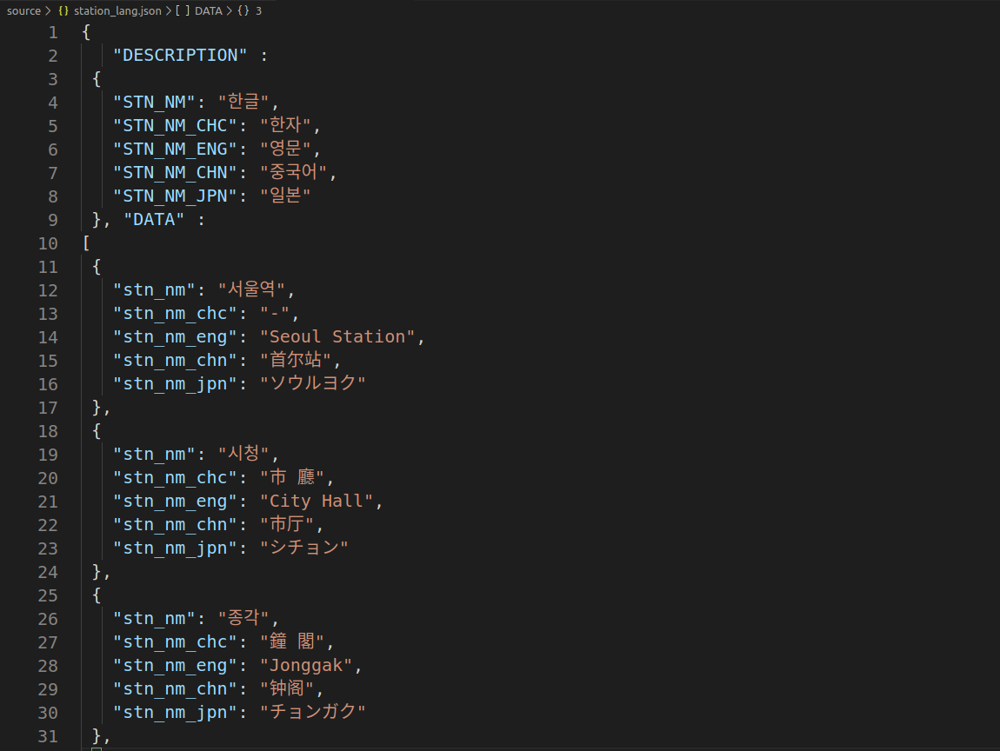
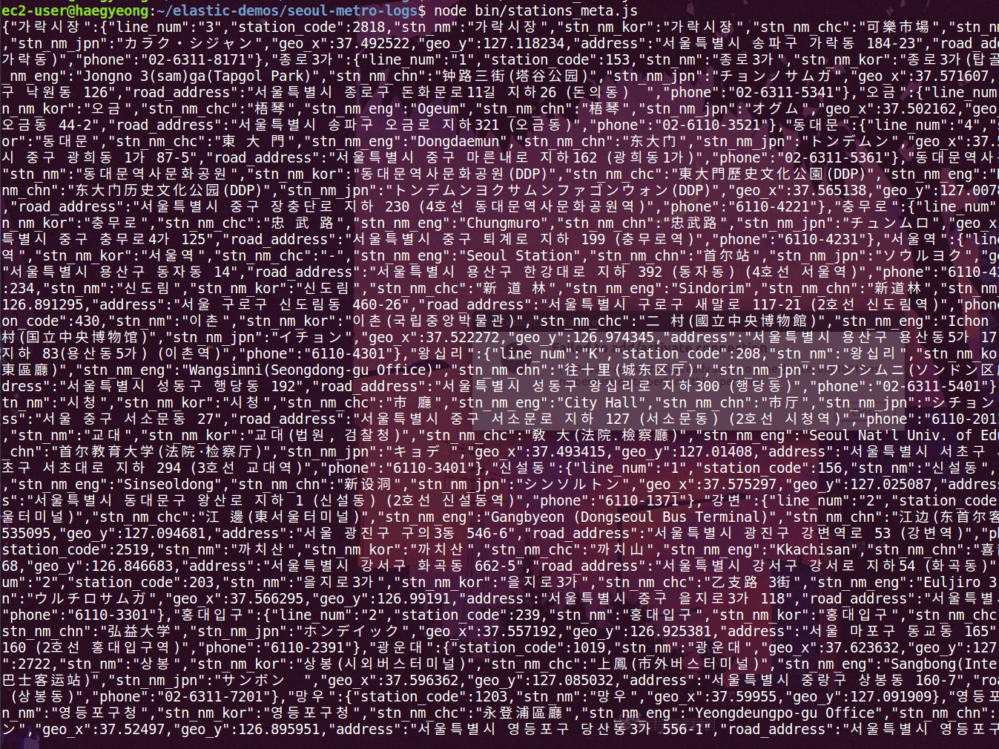
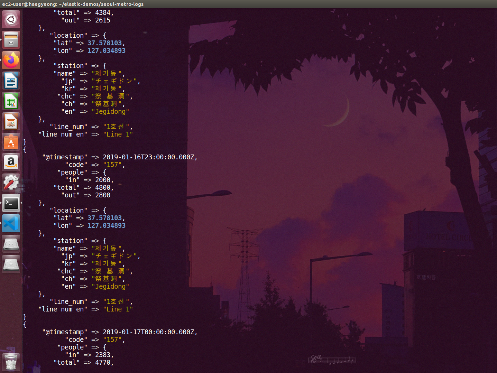
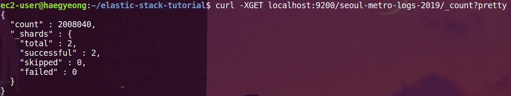
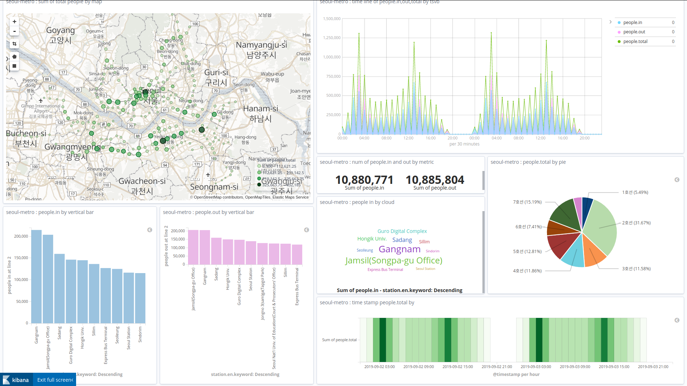

# 실습 진행 일지
본 일지와 실습 진행은 'Elastic Stack을 이용한 서울시 지하철 대시보드 다시 만들기' 유튜브 강의를 참고로 변경된 사항 위주로 작성하였음. 
https://www.youtube.com/watch?v=ypsEZXVYLo4&list=PLhFRZgJc2afqxJx0RBKkYUxSUDJNusXPl
## 1. 공공데이터로부터 추출, 색인, 매핑, 및 탬플릿 설정 부분까지

### 1.1. 공공 데이터 수집
서울 열린 데이터 광장 : http://data.seoul.go.kr/

##### 서울시 역코드로 지하철역 위치 조회
* json 파일 다운로드 
* source/station_info.json으로 저장

##### 서울교통공사 지하철 역명 다국어 표기 정보
* 서울교통공사 역명 다국어 표기 정보.xlsx 다운
    * exel파일을 csv파일로 저장(다른이름으로 저장)
    * A(연번), B(호선) 열 삭제
    * 1행 정보 수정
        * 역명 -> stn_nm
        * 한자 -> stn_nm_chc
        * 영문 -> stn_nm_eng
        * 중국어 -> stn_nm_chn
        * 일본어 -> stn_nm_jpn
    * 다음 url에 들어가 json파일로 변경 후 저장
        * http://convertcsv.com/csv-to-json.htm
    * 맨 앞에 다음 내용 추가
        * {
   "DESCRIPTION" :
 {
   "STN_NM": "한글",
   "STN_NM_CHC": "한자",
   "STN_NM_ENG": "영문",
   "STN_NM_CHN": "중국어",
   "STN_NM_JPN": "일본"
 }, "DATA" :  
* source/station_lang.json으로 저장


  
<변경한 csv 파일>  

  
<최종 json 파일>  

##### 서울교통공사 연도별 일별 시간대별 역별 승하차 인원
* 서울교통공사 2019년 일별 역별 시간대별 승하차인원(1_8호선).xlsx 다운
* source/metro_log_2019.csv로 저장
    * exel 파일 아래와 같이 수정 후 저장
    * 1번째 행 삭제
    * format에 맞게 변경 (날짜 format 등 bin/run.js에 명시돼있는대로)


##### 서울교통공사 지하철역 주소
* 1호선 ~ 4호선
    * 서울교통공사 지하철역 주소 및 전화번호 정보
    * source/station_addr_1to4.json으로 저장
* 5호선 ~ 8호선
    * 서울교통공사 지하철 역별 주소 정보
    * source/station_addr_5to8.json으로 저장
    * utf-8로 저장


### 1.2. 파일 변환 프로그램 실행

station_meta.js가 제대로 실행되는지 확인한다.  
이때 마지막 line을 다음과 같이 수정 후 log를 찍어본다.  
```
console.log("%j",stations_meta);
// module.exports = stations_meta;
```

`elastic-demos/seoul-metro-logs`경로에서 npm 패키지 설치  
```
$ npm install // 종속된 패키지 설치
$ node bin/stations_meta.js
```

  
<log 출력 결과>   

출력 결과 확인 후, 다시 station_meta.js의 마지막 line을 다음과 같이 수정한다.
```
// console.log("%j",stations_meta);
module.exports = stations_meta;
```

run.js를 실행하기 전 `seoul-metro-logs/data` DIR이 있는지 확인하고, run.js파일내의 `seoul_metro_log_YYYY.csv`의 파일 내용을 알맞는 년도에 맞게 수정한다.  
수정 후, `elastic-demos/seoul-metro-logs`경로에서 run.js를 수행한다.
```
$ node bin/run.js
```

#### logstash를 사용해서 ES에 data 넣기

* elastic : https://www.elastic.co/
* try free를 눌러 logstash를 다운받는다. 
* 경로는 `elastic-demos/seoul-metro-logs/`로 지정한다.
* tar xvf로 logstash의 압축을 해제한다.

`config/seoul-metro-logs.conf`파일에서 output을 stdout으로 설정한다. 
`seoul_metro_log_YYYY.csv`파일도 다시 년도에 맞게 설정한다.  
logstash를 실행시켜 data가 제대로 추출되는지 확인한다.   
```
$ logstash-7.8.0/bin/logstash -f config/seoul-metro-logs.conf 
```
  
<logstash data추출 확인 결과>  

확인이 되면 `config/seoul-metro-logs.conf`파일의 output을 다시 ES로 변경한다.

* logstash로 진행하다가, python으로 바꿈.

#### python을 사용해서 ES에 data 넣기
* python으로 ES사용하기 참고 사이트
    * https://soyoung-new-challenge.tistory.com/72
    * http://blog.naver.com/PostView.nhn?blogId=wideeyed&logNo=221494109911
    
* elastic version에 맞게 pip을 이용해 elastic 라이브러리를 다운받아준다.
* 본인은 elasticsearch 6.7.0 version을 사용하므로 elasticsearch6을 다운받았다. 
```
$ pip install elasticsearch6
```

* mapping 에 nori를 사용하므로, nori를 다운받아야한다.
* `elasticsearch/bin/`의 elasticsearch-plugin을 이용해 install한 후 ubuntu를 재시작한다.
```
$ ./elasticsearch-plugin install analysis-nori
```

* `config/`에 `seoul-metro-logs.py` 파일을 생성했다.  
* `seoul-metro-logs-2019.logs` 파일은 여러 json이 배열이 아닌, '\n' 개행문자로 구분되어있다.
* 따라서 해당파일을 한줄씩 읽어와 document로 삽입해주는 방식을 사용하였다.
* python3을 통하여 `seoul-metro-logs.py`을 실행시킨다.
```
$ python3 seoul-metro-logs.py
```

* 이때 mapping또는 nori에 의해 계속해서 오류가 난다면, index생성과 mapping을 쉘 단에서 curl명령어를 통해서 생성 및 적용시키도록한다.  
* mapping은 `index-settings-mappings_light.json`파일로 하도록한다.
* python은 `seoul-metro-logs_light.py`를 실행시킨다.
```
$ curl -XPUT localhost:9200/seoul-metro-logs-2019
```

* document가 잘 들어갔는지 확인하기 위해 다음 명령어를 실행해본다.
```
$ curl -XGET localhost:9200/seoul-metro-logs-2019/_count?pretty
```


  
<count 확인 명령어 수행 결과>  

### 1.3. Kibana
* kibana를 실행하여 각종 visualization을 한다.
* 승하차인원, 전체 유동인원을 시간대별, 지역별, 호선별 등을 기준으로 나누어 만들도록 한다.  

  
<최종 kibana dashboard>  